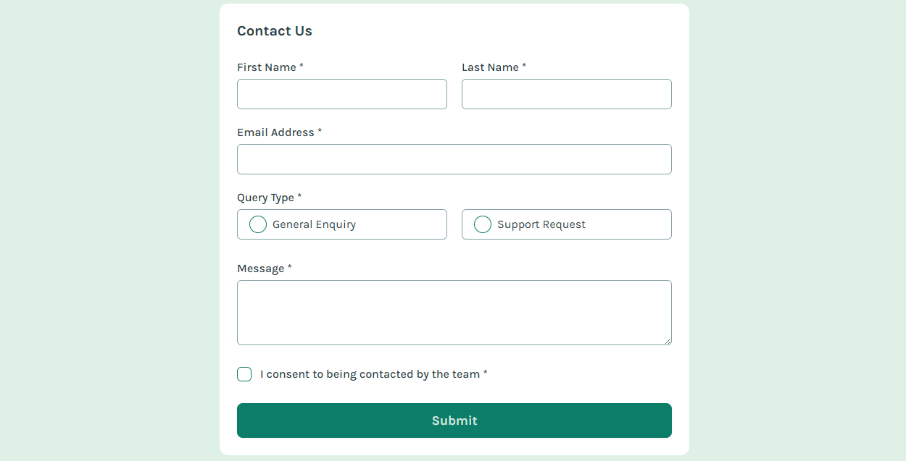

# Frontend Mentor - Contact form solution

This is a solution to the [Contact form challenge on Frontend Mentor](https://www.frontendmentor.io/challenges/contact-form--G-hYlqKJj). Frontend Mentor challenges help you improve your coding skills by building realistic projects. 

## Table of contents

- [Overview](#overview)
  - [The challenge](#the-challenge)
  - [Screenshot](#screenshot)
  - [Links](#links)
- [My process](#my-process)
  - [Built with](#built-with)
  - [What I learned](#what-i-learned)
- [Author](#author)

## Overview

### The challenge

Users should be able to:

- Complete the form and see a success toast message upon successful submission
- Receive form validation messages if:
  - A required field has been missed
  - The email address is not formatted correctly
- Complete the form only using their keyboard
- Have inputs, error messages, and the success message announced on their screen reader
- View the optimal layout for the interface depending on their device's screen size
- See hover and focus states for all interactive elements on the page

### Screenshot

### Links

- Solution URL: [Add solution URL here](https://github.com/FrontendMentor-Perpydel/fm-contact-form)
- Live Site URL: [Add live site URL here](https://fm-contact.netlify.app/)

## My process

### Built with

- Semantic HTML5 markup
- [DaisyUI](https://daisyui.com/) (Built on top of TailwindCSS) - For styles
- Flexbox
- CSS Grid
- Mobile-first workflow
- [React](https://reactjs.org/) - JS library

### What I learned

I was able to implement the useReducer hook for the first time without major issues with a simple project.So I can go on to implement it in a larger project, and then later implement it when using React Redux or Redux Toolkit.

I was also able to implement the DaisyUI built on top of TailwindCSS styling for more sophisticated styling and majorly using the different beautiful themes.
could come in handy for anyone viewing your solution or for yourself when you look back on this project in the future.**

## Author

- Website - [Perpetual Meninwa](https://pm-portfolio-drab.vercel.app/)
- Frontend Mentor - [@Perpy-del](https://www.frontendmentor.io/profile/Perpy-del)
- Twitter - [@pominspirational](https://x.com/pominpirational)

